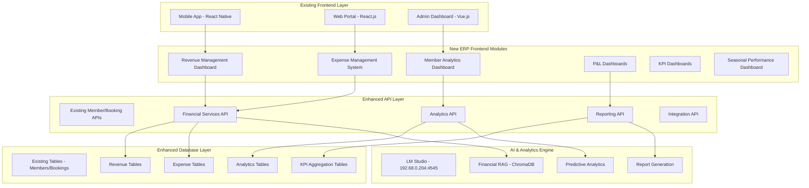
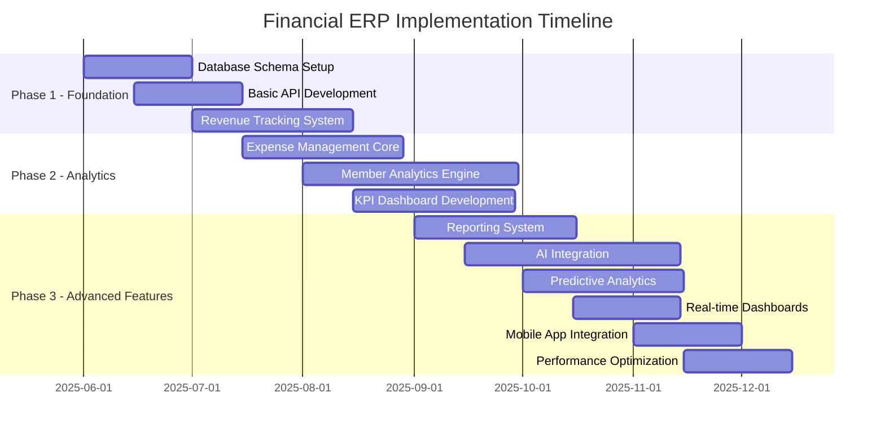

# Royal Golf Club - Comprehensive Financial ERP Integration Plan

## 🎯 Executive Overview

This plan integrates the complete financial ERP system with your existing Royal Golf Club infrastructure, extending the current React Native/React.js/Node.js/PostgreSQL stack to include comprehensive financial management, member analytics, and operational intelligence.

## 🏗️ System Integration Architecture



## 📊 Database Schema Extension Plan

### Phase 1: Revenue Management Tables

```sql
-- Green Fee Revenue Tracking
CREATE TABLE green_fee_transactions (
    id UUID PRIMARY KEY DEFAULT gen_random_uuid(),
    member_id UUID REFERENCES members(id),
    transaction_date TIMESTAMP NOT NULL,
    round_type VARCHAR(50) NOT NULL, -- 18-hole, 9-hole, twilight
    green_fee_amount DECIMAL(10,2) NOT NULL,
    cart_rental_amount DECIMAL(10,2) DEFAULT 0,
    guest_fees DECIMAL(10,2) DEFAULT 0,
    total_amount DECIMAL(10,2) NOT NULL,
    payment_method VARCHAR(50),
    weather_conditions VARCHAR(100),
    tee_time TIME,
    booking_id UUID REFERENCES bookings(id),
    created_at TIMESTAMP DEFAULT CURRENT_TIMESTAMP,
    updated_at TIMESTAMP DEFAULT CURRENT_TIMESTAMP
);

-- F&B Revenue Integration (extends existing)
CREATE TABLE fnb_revenue_tracking (
    id UUID PRIMARY KEY DEFAULT gen_random_uuid(),
    member_id UUID REFERENCES members(id),
    order_id UUID, -- Reference to existing order system
    transaction_date TIMESTAMP NOT NULL,
    location VARCHAR(50) NOT NULL, -- restaurant, bar, banquet, catering
    items JSONB NOT NULL,
    subtotal DECIMAL(10,2) NOT NULL,
    tax_amount DECIMAL(10,2) NOT NULL,
    tip_amount DECIMAL(10,2) DEFAULT 0,
    total_amount DECIMAL(10,2) NOT NULL,
    cost_of_goods DECIMAL(10,2),
    gross_margin DECIMAL(10,2),
    server_id UUID REFERENCES employees(id),
    created_at TIMESTAMP DEFAULT CURRENT_TIMESTAMP
);

-- Pro Shop Revenue Integration
CREATE TABLE pro_shop_revenue_tracking (
    id UUID PRIMARY KEY DEFAULT gen_random_uuid(),
    member_id UUID REFERENCES members(id),
    order_id UUID, -- Reference to existing order system
    transaction_date TIMESTAMP NOT NULL,
    items JSONB NOT NULL,
    subtotal DECIMAL(10,2) NOT NULL,
    tax_amount DECIMAL(10,2) NOT NULL,
    discount_amount DECIMAL(10,2) DEFAULT 0,
    total_amount DECIMAL(10,2) NOT NULL,
    cost_of_goods DECIMAL(10,2),
    gross_margin DECIMAL(10,2),
    staff_id UUID REFERENCES employees(id),
    created_at TIMESTAMP DEFAULT CURRENT_TIMESTAMP
);

-- Membership Revenue Tracking
CREATE TABLE membership_revenue (
    id UUID PRIMARY KEY DEFAULT gen_random_uuid(),
    member_id UUID REFERENCES members(id) NOT NULL,
    payment_date TIMESTAMP NOT NULL,
    payment_type VARCHAR(50) NOT NULL, -- dues, initiation, guest_fees, cart_fees
    amount DECIMAL(10,2) NOT NULL,
    period_start DATE,
    period_end DATE,
    payment_method VARCHAR(50),
    status VARCHAR(20) DEFAULT 'completed',
    transaction_reference VARCHAR(100),
    created_at TIMESTAMP DEFAULT CURRENT_TIMESTAMP
);
```

### Phase 2: Expense Management Tables

```sql
-- Course Maintenance Expenses
CREATE TABLE maintenance_expenses (
    id UUID PRIMARY KEY DEFAULT gen_random_uuid(),
    expense_date DATE NOT NULL,
    category VARCHAR(100) NOT NULL, -- equipment, chemicals, irrigation, labor
    subcategory VARCHAR(100),
    vendor_id UUID REFERENCES vendors(id),
    description TEXT NOT NULL,
    amount DECIMAL(10,2) NOT NULL,
    cost_center VARCHAR(50) NOT NULL,
    approval_status VARCHAR(20) DEFAULT 'pending',
    approved_by UUID REFERENCES employees(id),
    approved_at TIMESTAMP,
    invoice_number VARCHAR(100),
    metadata JSONB,
    created_at TIMESTAMP DEFAULT CURRENT_TIMESTAMP
);

-- Utility Expense Tracking
CREATE TABLE utility_expenses (
    id UUID PRIMARY KEY DEFAULT gen_random_uuid(),
    billing_period_start DATE NOT NULL,
    billing_period_end DATE NOT NULL,
    utility_type VARCHAR(50) NOT NULL, -- water, electricity, gas, waste, internet
    usage_amount DECIMAL(10,2),
    usage_unit VARCHAR(20),
    cost_per_unit DECIMAL(10,4),
    total_amount DECIMAL(10,2) NOT NULL,
    vendor_id UUID REFERENCES vendors(id),
    meter_reading_start DECIMAL(10,2),
    meter_reading_end DECIMAL(10,2),
    created_at TIMESTAMP DEFAULT CURRENT_TIMESTAMP
);

-- Payroll Integration (extends existing HR)
CREATE TABLE departmental_payroll (
    id UUID PRIMARY KEY DEFAULT gen_random_uuid(),
    employee_id UUID REFERENCES employees(id) NOT NULL,
    pay_period_start DATE NOT NULL,
    pay_period_end DATE NOT NULL,
    department VARCHAR(50) NOT NULL,
    cost_center VARCHAR(50),
    regular_hours DECIMAL(5,2) NOT NULL,
    overtime_hours DECIMAL(5,2) DEFAULT 0,
    regular_rate DECIMAL(8,2) NOT NULL,
    overtime_rate DECIMAL(8,2),
    gross_pay DECIMAL(10,2) NOT NULL,
    taxes DECIMAL(10,2) NOT NULL,
    benefits DECIMAL(10,2) DEFAULT 0,
    net_pay DECIMAL(10,2) NOT NULL,
    allocation_percentage DECIMAL(5,2) DEFAULT 100,
    created_at TIMESTAMP DEFAULT CURRENT_TIMESTAMP
);
```

### Phase 3: Member Analytics Tables

```sql
-- Member Visit Analytics
CREATE TABLE member_visit_analytics (
    id UUID PRIMARY KEY DEFAULT gen_random_uuid(),
    member_id UUID REFERENCES members(id) NOT NULL,
    visit_date DATE NOT NULL,
    check_in_time TIMESTAMP,
    check_out_time TIMESTAMP,
    activities JSONB NOT NULL, -- golf, dining, pro_shop, events
    total_spent DECIMAL(10,2) DEFAULT 0,
    golf_spend DECIMAL(10,2) DEFAULT 0,
    fnb_spend DECIMAL(10,2) DEFAULT 0,
    pro_shop_spend DECIMAL(10,2) DEFAULT 0,
    weather_conditions VARCHAR(100),
    visit_duration_minutes INTEGER,
    created_at TIMESTAMP DEFAULT CURRENT_TIMESTAMP
);

-- Member Spending Intelligence
CREATE TABLE member_spending_intelligence (
    id UUID PRIMARY KEY DEFAULT gen_random_uuid(),
    member_id UUID REFERENCES members(id) NOT NULL,
    analysis_period VARCHAR(20) NOT NULL, -- monthly, quarterly, yearly
    period_start DATE NOT NULL,
    period_end DATE NOT NULL,
    total_spent DECIMAL(10,2) NOT NULL,
    avg_spend_per_visit DECIMAL(10,2),
    visit_frequency INTEGER,
    golf_spend_percentage DECIMAL(5,2),
    fnb_spend_percentage DECIMAL(5,2),
    pro_shop_spend_percentage DECIMAL(5,2),
    preferred_activities JSONB,
    spending_trend VARCHAR(20), -- increasing, decreasing, stable
    retention_risk_score DECIMAL(3,2),
    ltv_prediction DECIMAL(10,2),
    created_at TIMESTAMP DEFAULT CURRENT_TIMESTAMP
);

-- Member Lifecycle Tracking
CREATE TABLE member_lifecycle_tracking (
    id UUID PRIMARY KEY DEFAULT gen_random_uuid(),
    member_id UUID REFERENCES members(id) NOT NULL,
    lifecycle_stage VARCHAR(50) NOT NULL, -- prospect, new, active, at_risk, churned
    stage_date DATE NOT NULL,
    previous_stage VARCHAR(50),
    retention_score DECIMAL(3,2),
    engagement_score DECIMAL(3,2),
    satisfaction_score DECIMAL(3,2),
    factors JSONB, -- Factors influencing stage change
    automated_flags JSONB,
    notes TEXT,
    created_at TIMESTAMP DEFAULT CURRENT_TIMESTAMP
);
```

## 🚀 API Architecture Extension

### Financial Services API Endpoints

```typescript
// Revenue Management API
interface RevenueAPI {
  // Revenue Tracking
  'GET /api/v1/erp/revenue/summary': {
    period: 'daily' | 'weekly' | 'monthly' | 'yearly';
    start_date?: string;
    end_date?: string;
  };
  
  'GET /api/v1/erp/revenue/streams': {
    stream_type?: 'green_fees' | 'membership' | 'fnb' | 'pro_shop' | 'events';
    department?: string;
  };
  
  'POST /api/v1/erp/revenue/transaction': {
    member_id: string;
    type: string;
    amount: number;
    details: object;
  };
  
  // Real-time Revenue Dashboard
  'GET /api/v1/erp/revenue/live': {
    dashboard_type: 'executive' | 'departmental';
  };
}

// Expense Management API
interface ExpenseAPI {
  'GET /api/v1/erp/expenses/summary': {
    category?: string;
    department?: string;
    period: string;
  };
  
  'POST /api/v1/erp/expenses/create': {
    category: string;
    amount: number;
    vendor_id?: string;
    description: string;
    cost_center: string;
  };
  
  'PUT /api/v1/erp/expenses/{id}/approve': {
    approved_by: string;
    notes?: string;
  };
  
  'GET /api/v1/erp/expenses/budget-variance': {
    department: string;
    period: string;
  };
}

// Member Analytics API
interface MemberAnalyticsAPI {
  'GET /api/v1/erp/members/spending-patterns': {
    member_id?: string;
    segment?: string;
    period: string;
  };
  
  'GET /api/v1/erp/members/retention-analysis': {
    risk_level?: 'low' | 'medium' | 'high';
    lifecycle_stage?: string;
  };
  
  'GET /api/v1/erp/members/lifetime-value': {
    member_id?: string;
    calculation_method: 'historical' | 'predictive';
  };
  
  'POST /api/v1/erp/members/engagement-score': {
    member_id: string;
    factors: object;
  };
}
```

## 📱 Frontend Component Integration Plan

### Mobile App Extensions (React Native)

```typescript
// New Screen Additions to existing navigation
interface NewMobileScreens {
  // Member Analytics Screens
  'MemberSpendingDashboard': {
    personalAnalytics: boolean;
    comparisonMetrics: boolean;
  };
  
  'PersonalFinancialSummary': {
    spending_breakdown: object;
    visit_analytics: object;
    rewards_tracking: object;
  };
  
  // Quick KPI Widgets for Home Screen
  'RevenueWidget': {
    real_time_data: boolean;
    department_filter: string;
  };
  
  'MemberEngagementWidget': {
    personal_metrics: boolean;
    club_averages: boolean;
  };
}

// Enhanced Home Screen Integration
const EnhancedHomeScreen = () => {
  return (
    <ScrollView>
      {/* Existing content */}
      <MemberSpendingWidget />
      <PersonalAnalyticsCard />
      <RecommendationsPanel />
      {/* New ERP widgets */}
    </ScrollView>
  );
};
```

### Web Portal Extensions (React.js)

```typescript
// New Dashboard Modules
interface WebPortalModules {
  // Executive Dashboard
  'ExecutiveDashboard': {
    revenue_overview: boolean;
    kpi_summary: boolean;
    department_performance: boolean;
    alerts_notifications: boolean;
  };
  
  // Department Manager Dashboards
  'FnBDashboard': {
    sales_analytics: boolean;
    cost_management: boolean;
    menu_profitability: boolean;
    staff_performance: boolean;
  };
  
  'ProShopDashboard': {
    inventory_analytics: boolean;
    sales_trends: boolean;
    member_preferences: boolean;
    profit_margins: boolean;
  };
  
  // Financial Reporting Suite
  'FinancialReports': {
    pl_statements: boolean;
    budget_variance: boolean;
    cash_flow: boolean;
    member_analytics: boolean;
  };
}

// Enhanced Admin Dashboard
const FinancialERPDashboard = () => {
  return (
    <Grid container spacing={3}>
      <Grid item xs={12} md={4}>
        <RevenueMetricsCard />
      </Grid>
      <Grid item xs={12} md={4}>
        <ExpenseAnalyticsCard />
      </Grid>
      <Grid item xs={12} md={4}>
        <MemberAnalyticsCard />
      </Grid>
      <Grid item xs={12}>
        <DepartmentalPLChart />
      </Grid>
      <Grid item xs={12} md={6}>
        <SeasonalTrendsChart />
      </Grid>
      <Grid item xs={12} md={6}>
        <MemberRetentionChart />
      </Grid>
    </Grid>
  );
};
```

## 🤖 AI Integration Enhancement

### Financial RAG System Extension

```python
# Enhanced Financial RAG Implementation
class FinancialRAGSystem:
    def __init__(self):
        self.revenue_rag = ChromaDB(collection="revenue_insights")
        self.expense_rag = ChromaDB(collection="expense_optimization")
        self.member_rag = ChromaDB(collection="member_intelligence")
        self.benchmark_rag = ChromaDB(collection="industry_benchmarks")
    
    async def generate_financial_insights(self, query_type: str, context: dict):
        """Generate AI-powered financial insights"""
        if query_type == "revenue_optimization":
            return await self.analyze_revenue_opportunities(context)
        elif query_type == "cost_reduction":
            return await self.identify_cost_savings(context)
        elif query_type == "member_retention":
            return await self.predict_churn_risk(context)
        elif query_type == "performance_benchmarking":
            return await self.benchmark_performance(context)
    
    async def analyze_revenue_opportunities(self, context: dict):
        """AI analysis of revenue optimization opportunities"""
        prompt = f"""
        Analyze the following golf club financial data and identify revenue optimization opportunities:
        
        Current Revenue Streams: {context['revenue_streams']}
        Member Spending Patterns: {context['spending_patterns']}
        Seasonal Trends: {context['seasonal_data']}
        
        Provide specific, actionable recommendations for:
        1. Revenue stream optimization
        2. Member engagement improvements
        3. Seasonal strategy adjustments
        4. New revenue opportunities
        """
        
        insights = await self.llm_client.generate_response(prompt)
        return self.structure_insights(insights)
```

### Predictive Analytics Engine

```python
class PredictiveFinancialAnalytics:
    def __init__(self):
        self.revenue_forecaster = RevenueForecaster()
        self.churn_predictor = ChurnPredictor()
        self.demand_forecaster = DemandForecaster()
    
    async def generate_revenue_forecast(self, historical_data: dict, forecast_period: int):
        """Generate revenue forecasts using ML models"""
        seasonal_patterns = self.extract_seasonal_patterns(historical_data)
        trend_analysis = self.analyze_trends(historical_data)
        external_factors = await self.get_external_factors()
        
        forecast = self.revenue_forecaster.predict(
            historical_data=historical_data,
            seasonal_patterns=seasonal_patterns,
            trends=trend_analysis,
            external_factors=external_factors,
            forecast_horizon=forecast_period
        )
        
        return {
            'forecast': forecast,
            'confidence_intervals': self.calculate_confidence_intervals(forecast),
            'key_assumptions': self.get_forecast_assumptions(),
            'risk_factors': self.identify_risk_factors()
        }
    
    async def predict_member_churn(self, member_data: dict):
        """Predict member churn probability"""
        features = self.extract_churn_features(member_data)
        churn_probability = self.churn_predictor.predict_proba(features)
        
        return {
            'churn_probability': churn_probability,
            'risk_factors': self.identify_churn_factors(features),
            'retention_recommendations': self.generate_retention_strategies(member_data),
            'intervention_priority': self.calculate_intervention_priority(churn_probability)
        }
```

## 📈 Implementation Phases



### Phase 1: Core Financial Infrastructure (Months 1-2)

**Phase 1 Deliverables:**
- Extended database schema with all financial tables
- Core revenue and expense tracking APIs
- Basic financial dashboard integration
- Member payment processing enhancement
- Integration with existing booking/order systems

### Phase 2: Advanced Analytics & Intelligence (Months 3-4)

**Phase 2 Deliverables:**
- Member spending intelligence system
- Departmental P&L automation
- KPI calculation engine
- Real-time financial dashboards
- Basic AI-powered insights
- Seasonal performance analysis

### Phase 3: Predictive Analytics & Optimization (Months 5-6)

**Phase 3 Deliverables:**
- Revenue forecasting system
- Member churn prediction
- Cost optimization recommendations
- Advanced reporting suite
- Mobile app financial features
- Performance optimization

## 🎯 Key Performance Indicators

### Financial KPIs

```typescript
interface FinancialKPIs {
  revenue: {
    total_revenue: number;
    revenue_per_member: number;
    revenue_growth_rate: number;
    seasonal_variance: number;
  };
  
  profitability: {
    gross_margin: number;
    net_margin: number;
    ebitda: number;
    department_margins: object;
  };
  
  efficiency: {
    cost_per_round: number;
    labor_cost_percentage: number;
    utility_cost_per_sqft: number;
    maintenance_cost_per_acre: number;
  };
  
  member_metrics: {
    member_retention_rate: number;
    avg_member_spend: number;
    member_acquisition_cost: number;
    member_lifetime_value: number;
  };
}
```

### Success Metrics

- **Revenue Optimization**: Target 10-15% increase in revenue per member
- **Cost Reduction**: Achieve 10-20% reduction in operational costs
- **Member Retention**: Improve retention rates by 15-25%
- **Operational Efficiency**: Increase staff productivity by 20-30%
- **Data-Driven Decisions**: 90% of strategic decisions backed by ERP data

## 🔧 Technical Implementation Details

### Integration with Existing Systems

```typescript
// Enhanced Member Service Integration
class EnhancedMemberService {
  async getMemberFinancialProfile(memberId: string) {
    const [basicProfile, spendingData, visitAnalytics] = await Promise.all([
      this.getBasicMemberProfile(memberId),
      this.getMemberSpendingIntelligence(memberId),
      this.getMemberVisitAnalytics(memberId)
    ]);
    
    return {
      ...basicProfile,
      financial_summary: spendingData,
      engagement_metrics: visitAnalytics,
      retention_risk: await this.calculateRetentionRisk(memberId),
      recommendations: await this.generateMemberRecommendations(memberId)
    };
  }
}

// Revenue Integration Service
class RevenueIntegrationService {
  async processTransaction(transaction: TransactionData) {
    // Process through existing payment system
    const paymentResult = await this.existingPaymentService.process(transaction);
    
    // Record in ERP system
    await this.recordRevenueTransaction({
      ...transaction,
      payment_reference: paymentResult.reference,
      financial_period: this.getCurrentFinancialPeriod(),
      cost_center: this.determineCostCenter(transaction.type)
    });
    
    // Update member analytics
    await this.updateMemberSpendingAnalytics(transaction.member_id, transaction);
    
    // Trigger real-time dashboard updates
    this.websocketService.broadcastUpdate('revenue_update', {
      amount: transaction.amount,
      type: transaction.type,
      timestamp: new Date()
    });
    
    return paymentResult;
  }
}
```

## 💼 Business Value & ROI

### Expected Returns

- **15-20% Revenue Growth** through optimized pricing and member engagement
- **25% Cost Reduction** via intelligent expense management and automation
- **30% Improvement** in member satisfaction and retention
- **40% Faster** financial reporting and decision-making
- **ROI Achievement** within 12-18 months of full implementation

### Competitive Advantages

- Real-time financial visibility across all departments
- Predictive analytics for proactive decision-making
- Member-centric revenue optimization
- Automated compliance and reporting
- Scalable architecture for future growth

This comprehensive ERP integration plan provides the Royal Golf Club with a complete financial management ecosystem that seamlessly integrates with existing infrastructure while delivering advanced analytics, AI-powered insights, and operational efficiency improvements.
