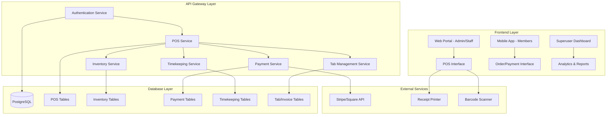

# POS Integration Architecture Plan
## Royal Golf Club ERP System Enhancement

### Executive Summary

This document outlines the comprehensive architectural plan for integrating Point of Sale (POS) features into the existing Royal Golf Club ERP system. The integration will enable food ordering from F&B components, member tab management, inventory updates for Pro Shop and F&B items, superuser dashboard analytics, and advanced timekeeping functionality.

### Current System Analysis

**Existing Infrastructure:**
- **Database:** PostgreSQL with UUID-based schema
- **Backend:** Node.js API Gateway with microservices architecture  
- **Frontend:** React web portal and mobile app
- **Authentication:** RBAC system with staff and member roles
- **Current Tables:** Members, staff, products, orders, financial_transactions

**Identified Gaps:**
- No POS transaction processing capability
- Limited inventory management for Pro Shop/F&B
- Missing member tab/invoice system
- No timekeeping functionality for employees
- Lack of payment processing integration

### Architecture Overview



## Database Schema Extensions

### 1. POS Core Tables

```sql
-- POS Terminals
CREATE TABLE pos_terminals (
    id UUID PRIMARY KEY DEFAULT gen_random_uuid(),
    terminal_name VARCHAR(100) NOT NULL,
    location VARCHAR(100) NOT NULL, -- 'pro_shop', 'fnb', 'clubhouse'
    ip_address INET,
    is_active BOOLEAN DEFAULT true,
    last_sync TIMESTAMP,
    created_at TIMESTAMP DEFAULT CURRENT_TIMESTAMP
);

-- POS Transactions
CREATE TABLE pos_transactions (
    id UUID PRIMARY KEY DEFAULT gen_random_uuid(),
    transaction_number VARCHAR(50) UNIQUE NOT NULL,
    terminal_id UUID REFERENCES pos_terminals(id),
    member_id UUID REFERENCES members(id),
    staff_id UUID REFERENCES staff(id),
    transaction_type VARCHAR(50) NOT NULL, -- 'sale', 'refund', 'tab_payment'
    subtotal DECIMAL(12,2) NOT NULL,
    tax_amount DECIMAL(12,2) DEFAULT 0,
    discount_amount DECIMAL(12,2) DEFAULT 0,
    tip_amount DECIMAL(12,2) DEFAULT 0,
    total_amount DECIMAL(12,2) NOT NULL,
    payment_method VARCHAR(50) NOT NULL, -- 'cash', 'card', 'member_account'
    payment_reference VARCHAR(100),
    status VARCHAR(50) DEFAULT 'completed',
    notes TEXT,
    created_at TIMESTAMP DEFAULT CURRENT_TIMESTAMP
);

-- POS Transaction Items
CREATE TABLE pos_transaction_items (
    id UUID PRIMARY KEY DEFAULT gen_random_uuid(),
    transaction_id UUID REFERENCES pos_transactions(id),
    product_id UUID REFERENCES products(id),
    quantity INTEGER NOT NULL,
    unit_price DECIMAL(10,2) NOT NULL,
    total_price DECIMAL(10,2) NOT NULL,
    discount_amount DECIMAL(10,2) DEFAULT 0,
    created_at TIMESTAMP DEFAULT CURRENT_TIMESTAMP
);
```

### 2. Enhanced Inventory Management

```sql
-- Inventory Categories
CREATE TABLE inventory_categories (
    id UUID PRIMARY KEY DEFAULT gen_random_uuid(),
    name VARCHAR(100) NOT NULL,
    type VARCHAR(50) NOT NULL, -- 'pro_shop', 'fnb'
    parent_category_id UUID REFERENCES inventory_categories(id),
    is_active BOOLEAN DEFAULT true,
    created_at TIMESTAMP DEFAULT CURRENT_TIMESTAMP
);

-- Inventory Movements
CREATE TABLE inventory_movements (
    id UUID PRIMARY KEY DEFAULT gen_random_uuid(),
    product_id UUID REFERENCES products(id),
    movement_type VARCHAR(50) NOT NULL, -- 'sale', 'purchase', 'adjustment', 'waste'
    quantity_change INTEGER NOT NULL, -- positive for additions, negative for reductions
    unit_cost DECIMAL(10,2),
    reference_id UUID, -- Reference to POS transaction, purchase order, etc.
    reference_type VARCHAR(50),
    staff_id UUID REFERENCES staff(id),
    notes TEXT,
    created_at TIMESTAMP DEFAULT CURRENT_TIMESTAMP
);

-- Suppliers
CREATE TABLE suppliers (
    id UUID PRIMARY KEY DEFAULT gen_random_uuid(),
    name VARCHAR(200) NOT NULL,
    contact_person VARCHAR(100),
    email VARCHAR(255),
    phone VARCHAR(20),
    address JSONB,
    payment_terms VARCHAR(100),
    is_active BOOLEAN DEFAULT true,
    created_at TIMESTAMP DEFAULT CURRENT_TIMESTAMP
);
```

### 3. Member Tabs/Invoices System

```sql
-- Member Tabs
CREATE TABLE member_tabs (
    id UUID PRIMARY KEY DEFAULT gen_random_uuid(),
    tab_number VARCHAR(50) UNIQUE NOT NULL,
    member_id UUID REFERENCES members(id),
    opened_by UUID REFERENCES staff(id),
    opened_at TIMESTAMP DEFAULT CURRENT_TIMESTAMP,
    closed_at TIMESTAMP,
    status VARCHAR(50) DEFAULT 'open', -- 'open', 'closed', 'paid'
    subtotal DECIMAL(12,2) DEFAULT 0,
    tax_amount DECIMAL(12,2) DEFAULT 0,
    total_amount DECIMAL(12,2) DEFAULT 0,
    notes TEXT
);

-- Tab Items
CREATE TABLE tab_items (
    id UUID PRIMARY KEY DEFAULT gen_random_uuid(),
    tab_id UUID REFERENCES member_tabs(id),
    product_id UUID REFERENCES products(id),
    quantity INTEGER NOT NULL,
    unit_price DECIMAL(10,2) NOT NULL,
    total_price DECIMAL(10,2) NOT NULL,
    added_by UUID REFERENCES staff(id),
    added_at TIMESTAMP DEFAULT CURRENT_TIMESTAMP
);

-- Tab Payments
CREATE TABLE tab_payments (
    id UUID PRIMARY KEY DEFAULT gen_random_uuid(),
    tab_id UUID REFERENCES member_tabs(id),
    payment_amount DECIMAL(12,2) NOT NULL,
    payment_method VARCHAR(50) NOT NULL,
    payment_reference VARCHAR(100),
    processed_by UUID REFERENCES staff(id),
    processed_at TIMESTAMP DEFAULT CURRENT_TIMESTAMP
);
```

### 4. Advanced Timekeeping System

```sql
-- Time Clock Entries
CREATE TABLE time_clock_entries (
    id UUID PRIMARY KEY DEFAULT gen_random_uuid(),
    employee_id UUID REFERENCES staff(id),
    clock_in TIMESTAMP NOT NULL,
    clock_out TIMESTAMP,
    break_start TIMESTAMP,
    break_end TIMESTAMP,
    total_hours DECIMAL(4,2),
    regular_hours DECIMAL(4,2),
    overtime_hours DECIMAL(4,2),
    department VARCHAR(100),
    shift_type VARCHAR(50), -- 'regular', 'weekend', 'holiday'
    approved_by UUID REFERENCES staff(id),
    approved_at TIMESTAMP,
    status VARCHAR(50) DEFAULT 'pending', -- 'pending', 'approved', 'rejected'
    notes TEXT,
    created_at TIMESTAMP DEFAULT CURRENT_TIMESTAMP
);

-- Break Records
CREATE TABLE break_records (
    id UUID PRIMARY KEY DEFAULT gen_random_uuid(),
    time_entry_id UUID REFERENCES time_clock_entries(id),
    break_start TIMESTAMP NOT NULL,
    break_end TIMESTAMP,
    break_type VARCHAR(50) DEFAULT 'regular', -- 'regular', 'lunch', 'sick'
    duration_minutes INTEGER,
    created_at TIMESTAMP DEFAULT CURRENT_TIMESTAMP
);

-- Department Time Allocation
CREATE TABLE department_time_allocation (
    id UUID PRIMARY KEY DEFAULT gen_random_uuid(),
    time_entry_id UUID REFERENCES time_clock_entries(id),
    department VARCHAR(100) NOT NULL,
    hours_allocated DECIMAL(4,2) NOT NULL,
    task_description TEXT,
    created_at TIMESTAMP DEFAULT CURRENT_TIMESTAMP
);
```

## API Routes Structure

### 1. POS Service Routes (`/api/v1/pos/`)

```javascript
// POS Transaction Routes
POST   /api/v1/pos/transactions              // Create new transaction
GET    /api/v1/pos/transactions              // Get transactions (with filters)
GET    /api/v1/pos/transactions/:id          // Get specific transaction
POST   /api/v1/pos/transactions/:id/refund   // Process refund
POST   /api/v1/pos/transactions/:id/void     // Void transaction

// Terminal Management
GET    /api/v1/pos/terminals                 // Get all terminals
POST   /api/v1/pos/terminals                 // Register new terminal
PUT    /api/v1/pos/terminals/:id             // Update terminal
POST   /api/v1/pos/terminals/:id/sync        // Sync terminal data

// Daily Operations
POST   /api/v1/pos/terminals/:id/open-shift  // Open cash drawer
POST   /api/v1/pos/terminals/:id/close-shift // Close shift with reconciliation
GET    /api/v1/pos/reports/daily-sales       // Daily sales report
```

### 2. Inventory Service Routes (`/api/v1/inventory/`)

```javascript
// Product Management
GET    /api/v1/inventory/products            // Get products with stock info
POST   /api/v1/inventory/products            // Create new product
PUT    /api/v1/inventory/products/:id        // Update product
DELETE /api/v1/inventory/products/:id        // Deactivate product

// Stock Management
POST   /api/v1/inventory/stock-adjustment    // Adjust stock levels
GET    /api/v1/inventory/low-stock           // Get low stock alerts
POST   /api/v1/inventory/receive-shipment    // Receive supplier shipment
GET    /api/v1/inventory/movements           // Get stock movement history

// Categories
GET    /api/v1/inventory/categories          // Get all categories
POST   /api/v1/inventory/categories          // Create category
PUT    /api/v1/inventory/categories/:id      // Update category
```

### 3. Tab Management Routes (`/api/v1/tabs/`)

```javascript
// Tab Operations
POST   /api/v1/tabs/open                     // Open new member tab
GET    /api/v1/tabs/member/:memberId         // Get member's open tabs
POST   /api/v1/tabs/:id/add-item            // Add item to tab
DELETE /api/v1/tabs/:id/remove-item/:itemId // Remove item from tab
POST   /api/v1/tabs/:id/close               // Close tab
POST   /api/v1/tabs/:id/payment             // Process tab payment

// Invoice Management
GET    /api/v1/tabs/invoices                // Get all unpaid invoices
GET    /api/v1/tabs/member/:memberId/invoices // Get member invoices
POST   /api/v1/tabs/invoices/:id/pay        // Pay invoice
```

### 4. Timekeeping Routes (`/api/v1/timekeeping/`)

```javascript
// Clock Operations
POST   /api/v1/timekeeping/clock-in          // Employee clock in
POST   /api/v1/timekeeping/clock-out         // Employee clock out
POST   /api/v1/timekeeping/break-start       // Start break
POST   /api/v1/timekeeping/break-end         // End break

// Timesheet Management
GET    /api/v1/timekeeping/timesheets        // Get timesheets (filtered)
PUT    /api/v1/timekeeping/timesheets/:id    // Update timesheet
POST   /api/v1/timekeeping/approve/:id       // Approve timesheet

// Reports
GET    /api/v1/timekeeping/reports/weekly    // Weekly time reports
GET    /api/v1/timekeeping/reports/payroll   // Payroll export
GET    /api/v1/timekeeping/reports/overtime  // Overtime reports
```

## Frontend Component Architecture

### 1. POS Interface Components

```
src/components/pos/
├── POSTerminal.tsx              // Main POS interface
├── ProductCatalog.tsx           // Product selection grid
├── ShoppingCart.tsx             // Transaction items
├── PaymentProcessor.tsx         // Payment methods
├── CustomerLookup.tsx           // Member search
├── ReceiptPrinter.tsx           // Print receipt
├── CashDrawer.tsx               // Cash management
└── RefundProcessor.tsx          // Handle refunds
```

### 2. Inventory Management Components

```
src/components/inventory/
├── ProductManagement.tsx        // CRUD products
├── StockAdjustment.tsx          // Adjust inventory
├── LowStockAlerts.tsx          // Stock alerts
├── SupplierManagement.tsx       // Supplier CRUD
├── PurchaseOrders.tsx           // Create PO
└── StockReports.tsx            // Inventory reports
```

### 3. Tab Management Components

```
src/components/tabs/
├── TabManagement.tsx            // Open/close tabs
├── MemberTabList.tsx           // Member's tabs
├── TabItemManager.tsx          // Add/remove items
├── InvoiceViewer.tsx           // View invoices
└── PaymentProcessor.tsx        // Process payments
```

### 4. Timekeeping Components

```
src/components/timekeeping/
├── TimeClockInterface.tsx       // Clock in/out
├── TimesheetViewer.tsx         // View timesheets
├── BreakTracker.tsx            // Track breaks
├── DepartmentTimeAllocation.tsx // Allocate time
├── TimesheetApproval.tsx       // Approve sheets
└── TimeReports.tsx             // Generate reports
```

## Integration Points

### 1. Role-Based Access Control Integration

```javascript
// POS Permissions
const POSPermissions = {
  SUPERUSER: ['pos_all_access', 'inventory_full', 'timekeeping_all'],
  MANAGER: ['pos_sales', 'inventory_view', 'timekeeping_department'],
  CASHIER: ['pos_sales', 'pos_refund_50', 'inventory_view_basic'],
  PROSHOP: ['pos_sales', 'pos_refund_100', 'inventory_proshop'],
  FNB: ['pos_sales', 'pos_refund_50', 'inventory_fnb']
};
```

### 2. Member Account Integration

```javascript
// Link POS transactions to member accounts
const processMemberTransaction = async (memberId, items, paymentMethod) => {
  if (paymentMethod === 'member_account') {
    // Add to member's tab or create financial transaction
    await createFinancialTransaction({
      member_id: memberId,
      transaction_type: 'pos_purchase',
      amount: total,
      status: 'pending'
    });
  }
};
```

## Payment Processing Integration

### Stripe Integration for Card Payments

```javascript
// Payment service implementation
class PaymentService {
  async processCardPayment(amount, paymentMethodId, description) {
    const paymentIntent = await stripe.paymentIntents.create({
      amount: Math.round(amount * 100), // Convert to cents
      currency: 'usd',
      payment_method: paymentMethodId,
      confirmation_method: 'manual',
      confirm: true,
      description: description
    });
    
    return paymentIntent;
  }
  
  async processMemberAccountPayment(memberId, amount, description) {
    // Add to member's account as pending charge
    return await createFinancialTransaction({
      member_id: memberId,
      transaction_type: 'pos_charge',
      amount: amount,
      description: description,
      status: 'pending'
    });
  }
}
```

## Mock Data Strategy

### F&B Items

```sql
-- Sample F&B Items
INSERT INTO products (sku, name, category, price, stock_quantity, min_stock_level) VALUES
('FNB001', 'Grilled Chicken Sandwich', 'fnb_sandwiches', 14.99, 50, 10),
('FNB002', 'Caesar Salad', 'fnb_salads', 12.99, 30, 5),
('FNB003', 'Draft Beer', 'fnb_beverages', 6.99, 100, 20),
('FNB004', 'Fish & Chips', 'fnb_entrees', 18.99, 25, 5),
('FNB005', 'Coffee', 'fnb_beverages', 3.99, 200, 50);
```

### Pro Shop Items

```sql
-- Sample Pro Shop Items
INSERT INTO products (sku, name, category, price, stock_quantity, min_stock_level) VALUES
('PRO001', 'Titleist Pro V1 Golf Balls', 'pro_golf_balls', 49.99, 25, 5),
('PRO002', 'Royal Golf Club Polo Shirt', 'pro_apparel', 79.99, 15, 3),
('PRO003', 'Callaway Sand Wedge', 'pro_clubs', 149.99, 8, 2),
('PRO004', 'Golf Glove', 'pro_accessories', 24.99, 40, 10),
('PRO005', 'Golf Hat', 'pro_apparel', 34.99, 20, 5);
```

## Performance Optimization

### 1. Database Indexing Strategy

```sql
-- POS Performance Indexes
CREATE INDEX idx_pos_transactions_date ON pos_transactions(created_at);
CREATE INDEX idx_pos_transactions_member ON pos_transactions(member_id);
CREATE INDEX idx_pos_transactions_terminal ON pos_transactions(terminal_id);
CREATE INDEX idx_inventory_movements_product ON inventory_movements(product_id);
CREATE INDEX idx_member_tabs_status ON member_tabs(status);
CREATE INDEX idx_time_clock_employee_date ON time_clock_entries(employee_id, created_at);
```

### 2. Caching Strategy

```javascript
// Redis caching for frequently accessed data
const cacheStrategy = {
  products: '1h',           // Product catalog
  memberTabs: '15m',        // Open member tabs
  inventory: '30m',         // Stock levels
  dailyReports: '6h'        // Daily sales reports
};
```

## Deployment Strategy

### 1. Database Migration Plan

```
Migration Sequence:
1. 03_pos_core_tables.sql       - Core POS functionality
2. 04_inventory_extensions.sql  - Enhanced inventory system
3. 05_member_tabs_system.sql    - Tab and invoice management
4. 06_timekeeping_system.sql    - Employee time tracking
5. 07_mock_data_insertion.sql   - Sample data for testing
6. 08_indexes_and_triggers.sql  - Performance optimization
```

### 2. Feature Rollout Plan

**Phase 1: Core POS (Week 1-2)**
- POS transaction processing
- Basic inventory management
- Staff interface implementation

**Phase 2: Member Integration (Week 3)**
- Member tab system
- Invoice management
- Member account charging

**Phase 3: Advanced Features (Week 4)**
- Timekeeping system
- Advanced reporting
- Payment processing integration

**Phase 4: Testing & Optimization (Week 5)**
- End-to-end testing
- Performance optimization
- User training preparation

## Security Considerations

### 1. Payment Data Security
- PCI DSS compliance for card transactions
- Encrypted storage of sensitive payment data
- Secure API communication with payment processors

### 2. Access Control
- Role-based permissions for all POS functions
- Audit logging for all financial transactions
- Session management for POS terminals

### 3. Data Protection
- Encryption at rest for financial data
- Regular backup procedures
- Data retention policies

## Success Metrics

### 1. Performance Metrics
- Transaction processing time < 3 seconds
- Inventory accuracy > 99%
- System uptime > 99.5%

### 2. Business Metrics
- Reduction in manual inventory management by 80%
- Improved member satisfaction with tab management
- Increased operational efficiency through timekeeping

### 3. User Adoption Metrics
- Staff training completion rate
- Daily active users of POS system
- Error rate reduction over time

## Conclusion

This comprehensive POS integration plan provides a robust foundation for enhancing the Royal Golf Club ERP system with modern point-of-sale capabilities. The phased implementation approach ensures minimal disruption to existing operations while delivering significant value through improved inventory management, member services, and operational efficiency.

The architecture maintains consistency with existing system patterns while introducing new capabilities that will position the golf club for future growth and enhanced member experiences.